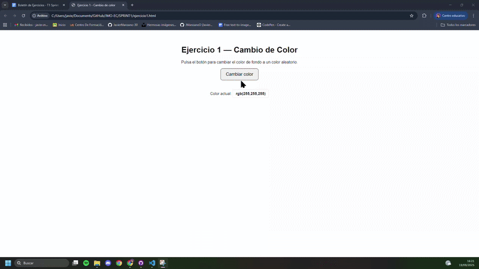
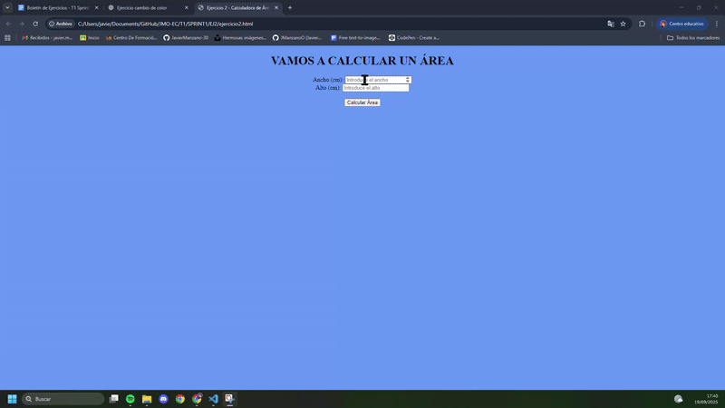
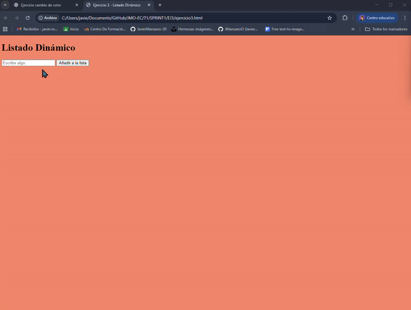
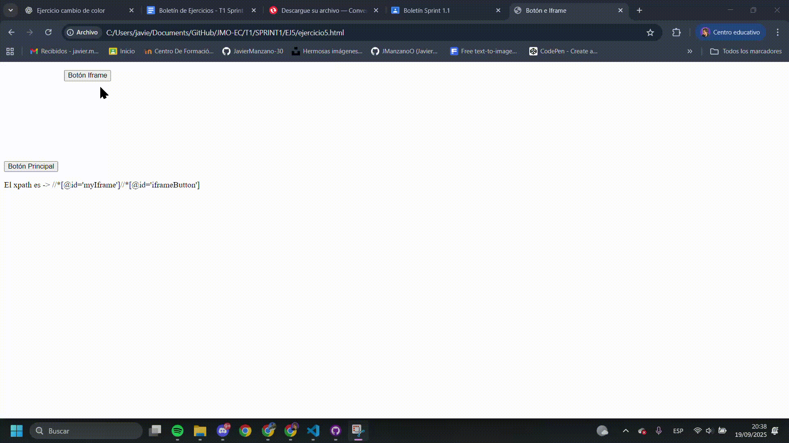

# Entorno Cliente - SPRINT 📚

Este repositorio contiene los ejercicios del primer sprint de Entorno Cliente.  
Cada ejercicio incluye su respectivo archivo HTML, archivo JS y un GIF de prueba mostrando el funcionamiento.

---

## 🟢 Ejercicio 1: Cambio de Color con Botón

**Descripción:**  
Se ha creado una página web con un botón **"Cambiar color"**.  
Al hacer clic en él, el fondo de la página cambia a un color aleatorio utilizando `Math.random()` para generar valores RGB.

**Archivos entregados:**  
- `ejercicio1.html`  
- `ejercicio1.js`

**Prueba:**  
El GIF muestra cómo al pulsar varias veces el botón el fondo cambia a diferentes colores.  

---

## 🟠 Ejercicio 2: Calculadora de Área

**Descripción:**  
Página con dos campos de entrada (`input`) para introducir el ancho y alto de un rectángulo.  
Al hacer clic en el botón **"Calcular Área"**, se multiplica ancho x alto y se muestra el resultado en un `
`.

**Archivos entregados:**  
- `ejercicio2.html`  
- `ejercicio2.js`

**Prueba:**  
El GIF muestra el cálculo correcto:  
- Con valores `2` y `2` devuelve `4`.  
- Con valores `2` y `9` devuelve `18`.  

---

## 🔵 Ejercicio 3: Listado Dinámico

**Descripción:**  
Página con un campo de entrada y un botón **"Añadir a la lista"**.  
Al escribir en el campo y pulsar el botón, se añade el texto como un nuevo elemento `<li>` a una lista (`<ul>` o `<ol>`).  

**Archivos entregados:**  
- `ejercicio3.html`  
- `ejercicio3.js`

**Prueba:**  
El GIF muestra cómo se añaden 3 elementos a la lista.  

---

## 🟡 Ejercicio 4: Hover y Estilo Dinámico

**Descripción:**  
Página con varios `div` con textos diferentes.  
Al pasar el ratón sobre un `div`, su fondo cambia a azul y el texto a blanco.  
Al salir, se restauran los estilos originales.  

**Archivos entregados:**  
- `ejercicio4.html`  
- `ejercicio4.js`

**Prueba:**  
El GIF muestra cómo los `div` cambian de color al pasar el ratón y vuelven a su estado inicial al salir.  

---

## 🔴 Ejercicio 5: Detección de Clics y Generación de XPath

**Descripción:**  
Se ha desarrollado una página que detecta los clics sobre cualquier elemento y genera el **XPath relativo** de dicho elemento.  
El XPath se muestra en una alerta.  

**Archivos entregados:**  
- `Ejercicio5.html` (HTML proporcionado, no modificable)  
- `ejercicio5.js`

**Prueba:**  
El GIF muestra cómo al hacer clic sobre diferentes botones aparece una alerta con su XPath relativo.  

---

✍️ *Autor: [Tu Nombre]*  
📅 *Sprint de Entorno Cliente*
