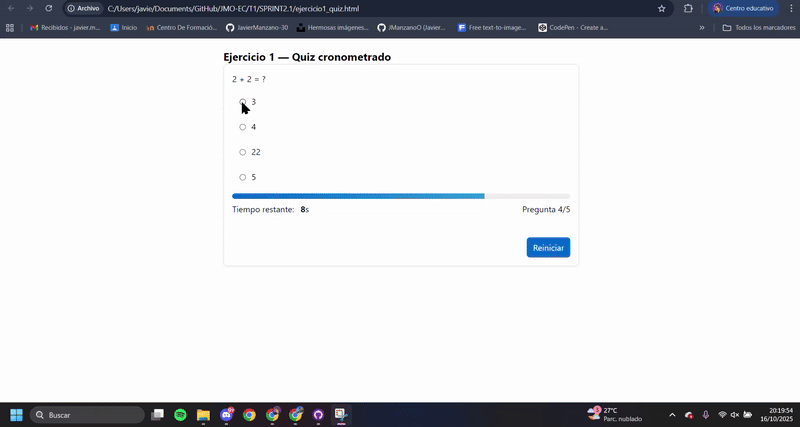
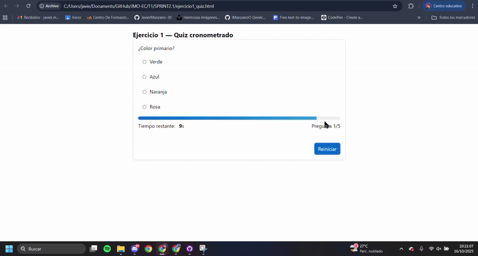
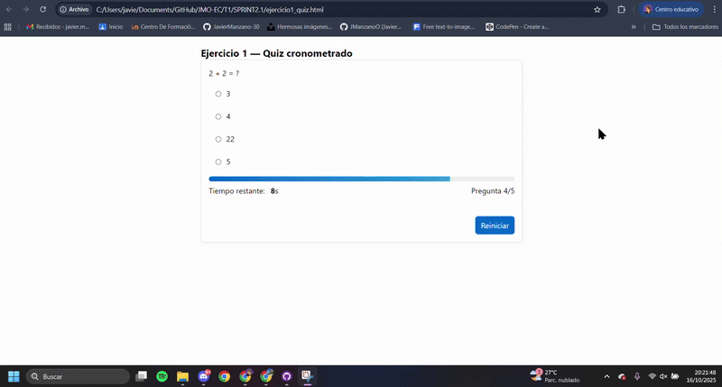
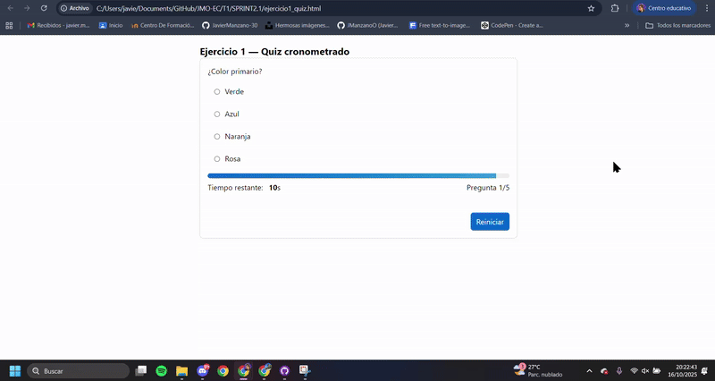
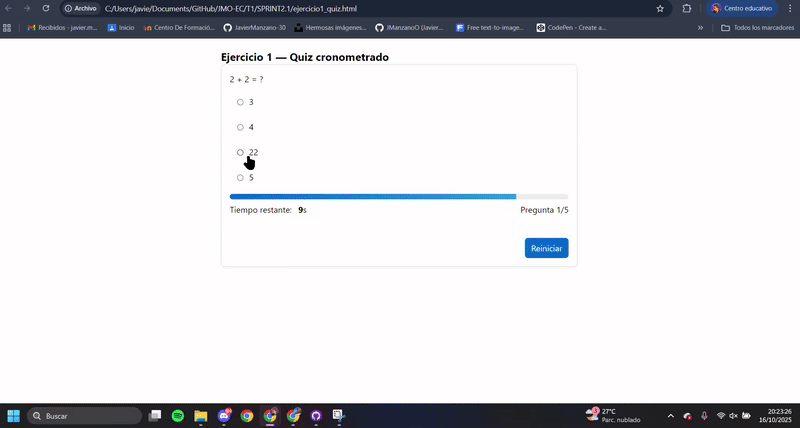
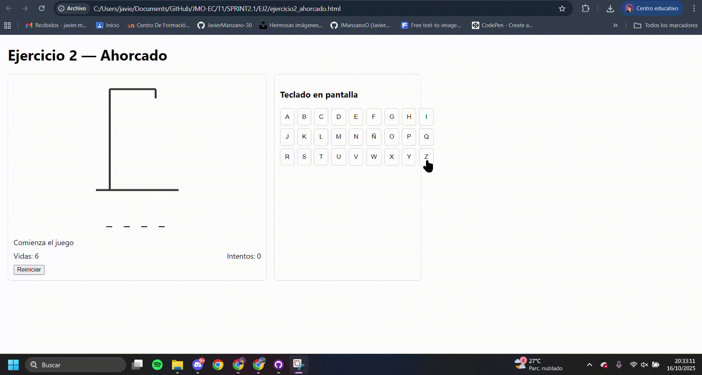

# 🧩 SPRINT 2.1 — Ejercicios: Quiz cronometrado y Ahorcado

Repositorio: `EC/T1/SPRINT2.1`  
Asignatura: Entornos de Desarrollo  
Autor: *[Tu nombre]*  
Fecha: *[Fecha de entrega]*  

---

## 🧠 Ejercicio 1: Quiz cronometrado por pregunta con barra de progreso y feedback inmediato

### Descripción
Crear un cuestionario en el que cada pregunta tenga un tiempo limitado para responder (por ejemplo, **10 segundos**).  
Mientras corre el tiempo, se muestra una **barra de progreso** que se reduce.  
Al seleccionar una opción, se muestra inmediatamente si es **correcta o incorrecta** y, tras un breve intervalo, se pasa a la siguiente pregunta.  
Al finalizar, se presenta un **resumen con la puntuación** y un **botón para reiniciar**.

### Estructura
**HTML:**
- Contenedor con el enunciado de la pregunta, opciones (radio buttons), barra de progreso y contador de tiempo.
- Área de feedback (aria-live).
- Botones “Siguiente” (opcional) y “Reiniciar”.

**JS:**
- Cargar un arreglo de preguntas y opciones.
- Manejar eventos `change`/`click` en las respuestas.
- Iniciar y detener un temporizador por pregunta con `setInterval` y `clearInterval`.
- Actualizar la barra de progreso y el contador.
- Mostrar feedback inmediato (**Correcto/Incorrecto/Tiempo agotado**).
- Avanzar a la siguiente pregunta y mostrar el resumen final con opción de reinicio.

### Objetivos
- Manejo de eventos (`change`/`click`).
- Temporización por pregunta.
- Manipulación del DOM para actualizar tiempo, barra y feedback.
- Gestión de estado (índice de pregunta y puntuación).
- Accesibilidad básica con regiones `aria-live`.

---

### 🧪 Pruebas y evidencias (GIFs)

1. Seleccionar la opción correcta y verificar que aparece el mensaje **“Correcto”** y se avanza a la siguiente pregunta.  
   

2. Seleccionar una opción incorrecta y verificar que aparece **“Incorrecto”** con marcado visual antes de avanzar.  
   

3. No seleccionar nada y dejar que el tiempo llegue a 0; verificar **“Tiempo agotado”** y el avance automático.  
   

4. Confirmar que la barra de progreso se reduce sincronizada con el contador (de 10 a 0).  
   

5. Completar todas las preguntas, comprobar que se muestra la puntuación final y que el botón **“Reiniciar”** reinicia el quiz.  
   

---

## 🎮 Ejercicio 2: Ahorcado con teclado físico y teclado en pantalla

### Descripción
Implementar el juego del **ahorcado**, donde la aplicación elige una palabra aleatoria y el usuario intenta adivinarla letra a letra.  
Debe poderse jugar tanto con el **teclado físico (keydown)** como con un **teclado en pantalla** (botones A–Z y Ñ).  
Las letras usadas se deshabilitan; con cada fallo se muestra una parte del muñeco.  
La partida termina al adivinar la palabra o al agotar las vidas, con opción de **reiniciar**.

### Estructura
**HTML:**
- Área para la palabra oculta (guiones bajos o espacios).
- Contador de vidas y mensaje de estado (`aria-live`).
- Teclado en pantalla con botones de letras (incluida Ñ).
- Botón “Reiniciar”.
- Área gráfica (por ejemplo, SVG) para dibujar las partes del ahorcado.

**JS:**
- Lista de palabras y selección aleatoria.
- Normalización de entradas (mayúsculas y soporte de Ñ).
- Manejo de eventos `click` (teclado virtual) y `keydown` (teclado físico).
- Lógica para revelar letras correctas, deshabilitar letras usadas y contar fallos.
- Actualización del DOM (palabra, vidas, dibujo).
- Detección de victoria/derrota y bloqueo del teclado.
- Reinicio del juego.

### Objetivos
- Manejo combinado de eventos (`keydown` y `click`).
- Manipulación del DOM para palabra, teclado y dibujo del muñeco.
- Control de estado (vidas, letras usadas, fin de partida).
- Buenas prácticas de accesibilidad (`aria-live` para mensajes).

---

### 🧪 Pruebas y evidencias (GIFs)

1. Pulsar varias letras en el teclado en pantalla: se deshabilitan, revelan aciertos y contabilizan fallos.  
   

2. Usar el teclado físico (por ejemplo, A, E, Ñ) y verificar que actúa igual que el teclado en pantalla.  
   

3. Forzar fallos para ver cómo disminuyen las vidas y aparecen, paso a paso, las partes del muñeco.  
   

4. Completar la palabra y comprobar el mensaje de victoria y el bloqueo del teclado.  
   

5. Agotar todas las vidas y comprobar el mensaje de derrota y el bloqueo del teclado.  
   

6. Pulsar **“Reiniciar”** y verificar que se carga una nueva palabra y se limpia el estado.  
   

---

## 📂 Criterios en el formato de entrega

- Cada ejercicio se entrega en **archivos HTML y JS separados** dentro de `EC/T1/SPRINT2.1`.
- Los **GIFs** deben visualizarse correctamente dentro del `README.md` (no como enlaces externos).
- No se desplegarán las páginas: se evaluarán abriendo los `.html` directamente en el navegador.
- Respetar la estructura del repositorio y los plazos de entrega establecidos en Classroom.

---
