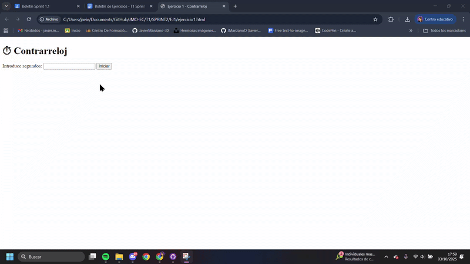
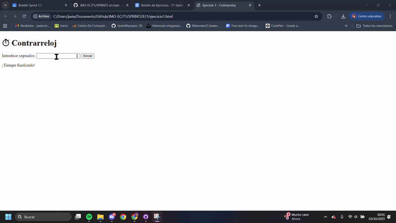
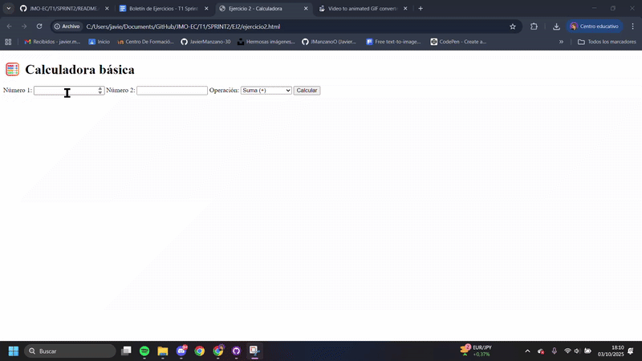
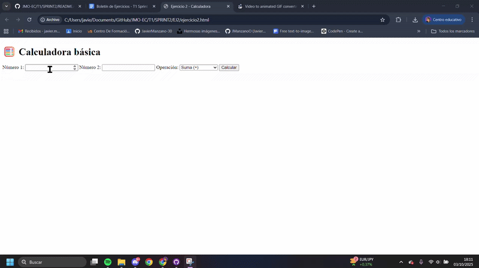
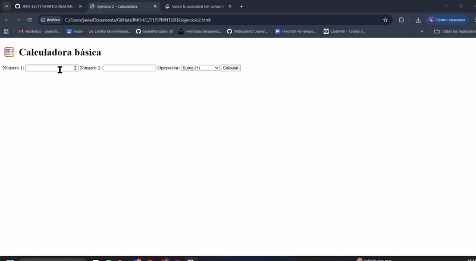
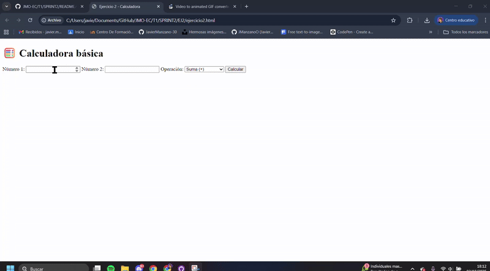
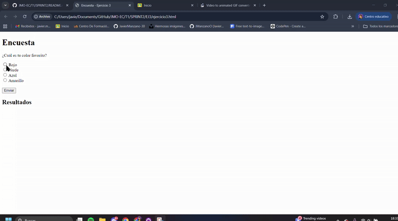
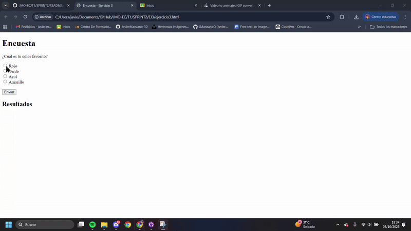
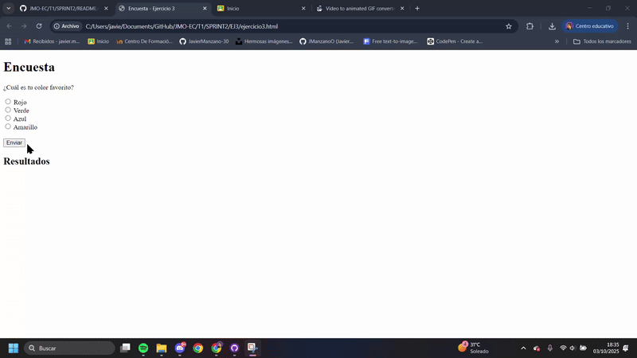
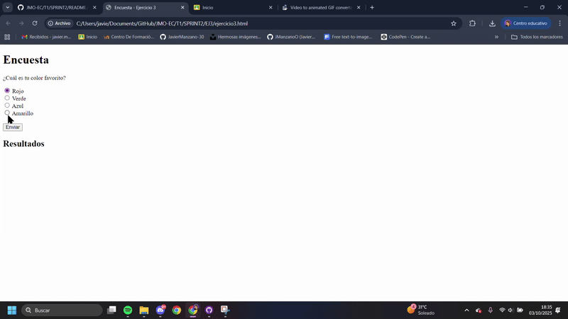

# 💻 SPRINT 2 – Entorno Cliente (2º DAW)

Este sprint contiene los ejercicios prácticos de HTML + JavaScript correspondientes al segundo boletín.  
Cada ejercicio se encuentra dividido en dos archivos:  
- Un archivo **.html** (estructura visual)  
- Un archivo **.js** (lógica funcional)  

La estructura del repositorio es la siguiente:

```
└── EC/
    └── T1/
        └── SPRINT2/
            └── EJ1/
                ├── ejercicio1.html
                ├── ejercicio1.js
            └── EJ2/
                ├── ejercicio2.html
                ├── ejercicio2.js
            └── EJ3/
                ├── ejercicio3.html
                ├── ejercicio3.js
            └── EJ4/
                ├── ejercicio4.html
                ├── ejercicio4.js
            └── EJ5/
                ├── ejercicio5.html
                ├── ejercicio5.js
                └── img/
                    ├── coche.png
                    ├── corazon.png
                    ├── estrella.png
                    ├── flor.png
                    ├── gato.png
                    ├── luna.png
                    ├── perro.png
                    ├── reverso.png
                    ├── sol.png
            └── gifs/
                ├── ejercicio1.gif
                ├── ejercicio1.2.gif
                ├── ejercicio2.gif
                ├── ejercicio3.gif
                ├── ejercicio4.gif
                ├── ejercicio5.gif
            ├── README.md
```

---

## 🕐 Ejercicio 1: Contrarreloj

**Descripción:**  
Temporizador simple que cuenta hacia atrás desde los segundos introducidos por el usuario.  
Al llegar a cero, muestra el mensaje “¡Tiempo finalizado!”.

**Objetivos:**
- Manejo de eventos `click`
- Uso de `setInterval` y `clearInterval`
- Manipulación del DOM

**Archivos:**  
`ejercicio1.html` | `ejercicio1.js`

**Pruebas realizadas (GIF):**
- Cuenta regresiva desde 2 segundos
  
- Cuenta regresiva desde 4 segundos  


---

## ➕ Ejercicio 2: Calculadora Básica

**Descripción:**  
Calculadora que permite realizar operaciones básicas (suma, resta, multiplicación y división) entre dos números seleccionados.

**Objetivos:**
- Manejo de eventos `click`
- Validación de entradas
- Uso de operadores aritméticos

**Archivos:**  
`ejercicio2.html` | `ejercicio2.js`

**Pruebas realizadas (GIF):**
- `Sumar 10 + 12 = 22`  

- `Resta 10 - 12 = -2`  

- `Multiplicar 5 X 4 = 20 y 5 X 0 = 0`  

- `Dividir 5 / 4 = 1.25 y 5 / 0 = "INDEFINIDO"`  


---

## 🧠 Ejercicio 3: Encuesta con Gráfico de Resultados

**Descripción:**  
Página con una encuesta de selección única.  
Cada voto actualiza dinámicamente un gráfico de barras que muestra el total de respuestas por opción.

**Objetivos:**
- Manejo de eventos `click`
- Manipulación del DOM
- Actualización dinámica de un gráfico con HTML y CSS

**Archivos:**  
`ejercicio3.html` | `ejercicio3.js`

**Pruebas realizadas (GIF):**
- `Verificar que al seleccionar una opción y hacer clic en "Enviar", se actualicen correctamente los votos en el gráfico.`  

- `Comprobar que el gráfico de barras se actualiza dinámicamente después de cada nueva votación.`  

- `Probar que el sistema gestiona correctamente intentos de envío sin seleccionar ninguna opción.`  

- `Verificar que las votaciones previas se mantienen después de varias interacciones.`  


---

## ⏱ Ejercicio 4: Cronómetro con Controles

**Descripción:**  
Cronómetro con botones para **Iniciar**, **Pausar** y **Reiniciar**.  
Muestra el tiempo transcurrido en minutos y segundos.

**Objetivos:**
- Manejo de múltiples eventos `click`
- Uso de `setInterval` y `clearInterval`
- Actualización continua del DOM

**Archivos:**  
`ejercicio4.html` | `ejercicio4.js`

**Pruebas realizadas (GIF):**
- Inicio y conteo correcto del tiempo  
- Pausa del cronómetro  
- Reinicio a `00:00`  
- Reanudación correcta tras pausa  


---

## 🃏 Ejercicio 5: Juego de Memoria con Imágenes

**Descripción:**  
Juego de memoria en el que el jugador debe emparejar imágenes iguales.  
Si las cartas coinciden, permanecen descubiertas; si no, se vuelven a tapar tras un breve intervalo.  
Incluye botón de **Reiniciar** que baraja las cartas y reinicia el juego.

**Objetivos:**
- Uso de `setTimeout` para lógica temporal
- Comparación de elementos dinámicos
- Manipulación avanzada del DOM
- Barajado de arrays y reinicio del juego

**Archivos:**  
`ejercicio5.html` | `ejercicio5.js`

**Pruebas realizadas (GIF):**
- Dos cartas no coincidentes se tapan tras 0.8s  
- Dos cartas iguales permanecen visibles  
- Mensaje de victoria al encontrar todas las parejas  
- Reinicio del juego correctamente barajado  


---

## 📸 Capturas estáticas (si aplica)

Incluye capturas de pantalla de los ejercicios que no requieran interacción (por ejemplo, estructuras o maquetas simples).

---

## 🗂 Formato de entrega

- Todos los ejercicios se encuentran en la carpeta `SPRINT2`.  
- Los GIFs están incrustados en este `README.md`.  
- La estructura del repositorio respeta el formato:  
  `EC → T1 → SPRINT2`

---

✍️ **Autor:** *[Tu Nombre Aquí]*  
📆 **Fecha:** *Octubre 2025*  
🏫 **Módulo:** *Entorno Cliente – 2º DAW*
