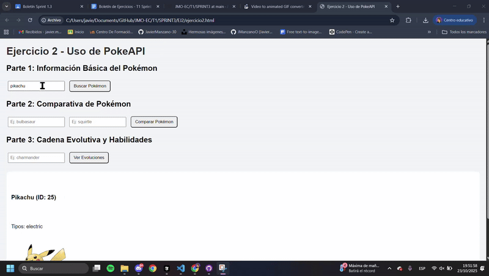
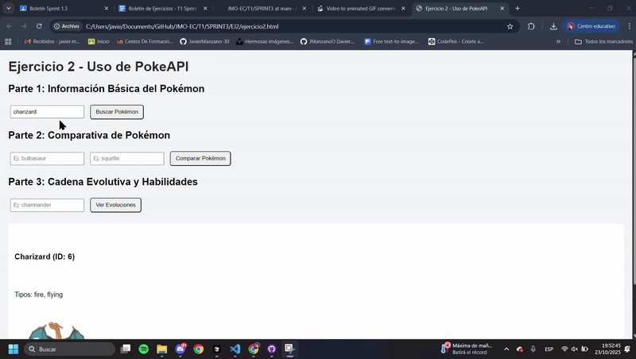

# 💻 SPRINT 3 – Desarrollo Full-Stack (2º DAW)

Este sprint contiene los ejercicios prácticos de desarrollo full-stack con integración de frontend y backend, incluyendo gestión de base de datos MySQL.  
Cada ejercicio se encuentra dividido en archivos específicos:  
- Un archivo **.html** (estructura visual)  
- Un archivo **.js** (lógica funcional)  
- Un archivo **.css** (estilos) para ejercicios 3, 4 y 5

La estructura del repositorio es la siguiente:

```
└── EC/
    └── T1/
        └── SPRINT3/
            └── EJ1/
                ├── ejercicio1.html
                └── ejercicio1.js
            └── EJ2/
                ├── ejercicio2.html
                └── ejercicio2.js
            └── EJ3/
                ├── index.html
                ├── script.js
                └── styles.css
            └── EJ4/
                ├── index.html
                ├── script.js
                └── styles.css
            └── EJ5/
                ├── index.html
                ├── script.js
                └── styles.css
            └── Cosas/
                ├── guild-management-BackEnd.exe
                ├── guild-management-api.yml
                └── guild_management/
            └── gifs/
                ├── ejercicio3.1.gif
                ├── ejercicio3.2.gif
                ├── ejercicio3.3.gif
                ├── ejercicio3.4.gif
                ├── ejercicio3.5.gif
                ├── ejercicio3.6.gif
                ├── ejercicio4.1.gif
                ├── ejercicio4.2.gif
                ├── ejercicio4.3.gif
                ├── ejercicio4.4.gif
                └── ejercicio4.5.gif
            ├── README.md
            └── test-mysql.js
```

---

## 📊 Ejercicio 1: Análisis y Transformación de Datos

**Descripción:**  
Sistema de análisis de datos de estudiantes con funcionalidades avanzadas de filtrado, cálculo de promedios y transformación de datos.  
Permite consultar información detallada sobre estudiantes, sus calificaciones y becas.

**Objetivos:**
- Manipulación de arrays y objetos complejos
- Filtrado y ordenación de datos
- Cálculos estadísticos y transformaciones
- Interfaz de usuario interactiva

**Archivos:**  
`ejercicio1.html` | `ejercicio1.js`

**Funcionalidades implementadas:**
- Estudiantes destacados por asignatura
- Asignatura con menor rendimiento
- Mejora de notas para estudiantes con beca
- Filtrado por ciudad y asignatura
- Análisis de estudiantes sin beca
- Promedio de edad de estudiantes con beca
- Mejores estudiantes por promedio general
- Lista de estudiantes aprobados en todas las asignaturas

---

## 🎮 Ejercicio 2: Integración con PokeAPI

**Descripción:**  
Aplicación web que utiliza la API pública de Pokémon para obtener información detallada, realizar comparativas y mostrar cadenas evolutivas.  
Integración completa con servicios REST externos.

**Objetivos:**
- Consumo de APIs REST externas
- Manejo de promesas y async/await
- Procesamiento de datos JSON complejos
- Manejo de errores en peticiones HTTP

**Archivos:**  
`ejercicio2.html` | `ejercicio2.js`

**Funcionalidades implementadas:**
- Búsqueda de información básica de Pokémon
- Comparativa detallada entre dos Pokémon
- Visualización de cadenas evolutivas completas
- Tabla comparativa de estadísticas
- Manejo de errores y validaciones

**Pruebas realizadas (GIF):**
- Búsqueda de información básica de Pikachu  

- Comparativa entre Bulbasaur y Squirtle  

- Cadena evolutiva de Charmander  


---

## ⚔️ Ejercicio 3: Sistema de Gestión de Guild

**Descripción:**  
Aplicación completa de gestión de miembros de guild con interfaz moderna y funcionalidades CRUD completas.  
Integración con base de datos MySQL para persistencia de datos.

**Objetivos:**
- Desarrollo de aplicaciones full-stack
- Integración frontend-backend con APIs REST
- Gestión de base de datos MySQL
- Interfaz de usuario responsiva y moderna

**Archivos:**  
`index.html` | `script.js` | `styles.css`

**Funcionalidades implementadas:**
- CRUD completo de miembros de guild
- Búsqueda y filtrado de usuarios
- Validación de formularios
- Integración con base de datos MySQL
- Interfaz moderna con diseño responsivo

**Pruebas realizadas (GIF):**
- Visualización de todos los miembros de la guild  

- Búsqueda y filtrado de miembros  

- Creación de nuevos miembros  

- Edición de información de miembros  

- Eliminación de miembros  

- Validación de formularios  


---

## 🎯 Ejercicio 4: Party Finder Básico

**Descripción:**  
Sistema de creación y gestión de parties para juegos online.  
Permite crear grupos de diferentes tamaños y gestionar la participación de miembros.

**Objetivos:**
- Gestión de relaciones entre entidades
- Validación de reglas de negocio
- Interfaz de usuario intuitiva
- Integración con base de datos

**Archivos:**  
`index.html` | `script.js` | `styles.css`

**Funcionalidades implementadas:**
- Creación de parties de tamaño 3, 5 y 8
- Gestión de miembros en parties
- Validación de límites de participantes
- Interfaz de usuario moderna con modales

**Pruebas realizadas (GIF):**
- Creación de party de tamaño 5  

- Añadir miembros a la party  

- Validación de límites de miembros  

- Gestión de múltiples parties  

- Creación de usuarios nuevos  


---

## 🚀 Ejercicio 5: Party Finder Avanzado

**Descripción:**  
Versión avanzada del sistema de gestión de parties con backend propio desarrollado en Node.js.  
Incluye funcionalidades adicionales y mejor gestión de errores.

**Objetivos:**
- Desarrollo de backend completo con Node.js
- Gestión avanzada de base de datos MySQL
- Manejo robusto de errores
- Validaciones avanzadas del lado del servidor

**Archivos:**  
`index.html` | `script.js` | `styles.css`

**Funcionalidades implementadas:**
- Backend propio desarrollado en Node.js
- Gestión completa de usuarios y parties
- Validaciones avanzadas
- Manejo robusto de errores
- Interfaz mejorada con más funcionalidades

**Características técnicas:**
- Servidor Node.js con Express
- Conexión directa a MySQL
- API REST completa
- Manejo de errores HTTP
- Validación de datos del lado del servidor

---

## 🗂 Formato de entrega

- Todos los ejercicios se encuentran en la carpeta `SPRINT3`.  
- Los GIFs están incrustados en este `README.md`.  
- La estructura del repositorio respeta el formato:  
  `EC → T1 → SPRINT3`
- Los ejercicios 3, 4 y 5 incluyen integración con base de datos MySQL
- El ejercicio 5 incluye backend propio funcional

---

✍️ **Autor:** *[Javier Manzano Oliveros]*  
📆 **Fecha:** *Octubre 2025*  
🏫 **Módulo:** *Entorno Cliente – 2º DAW*
