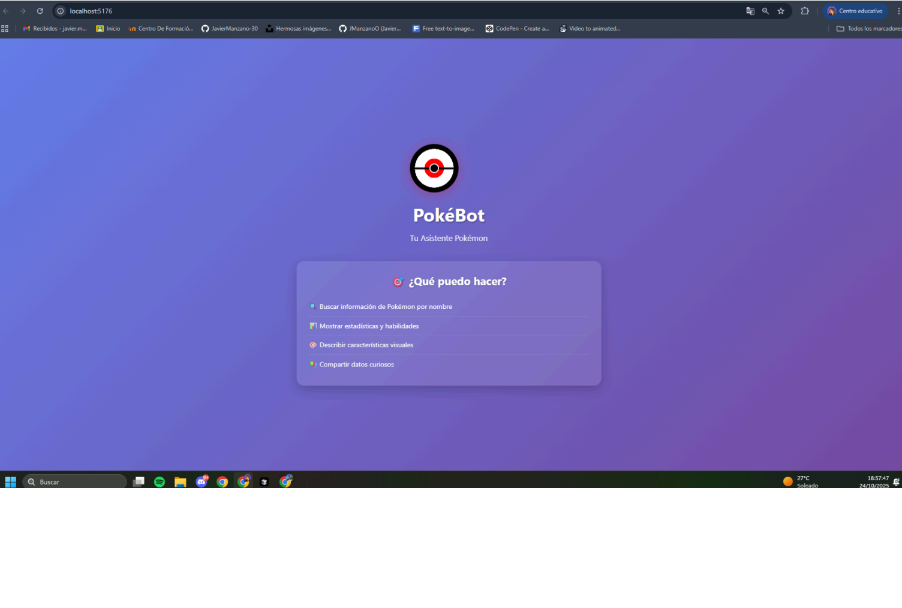
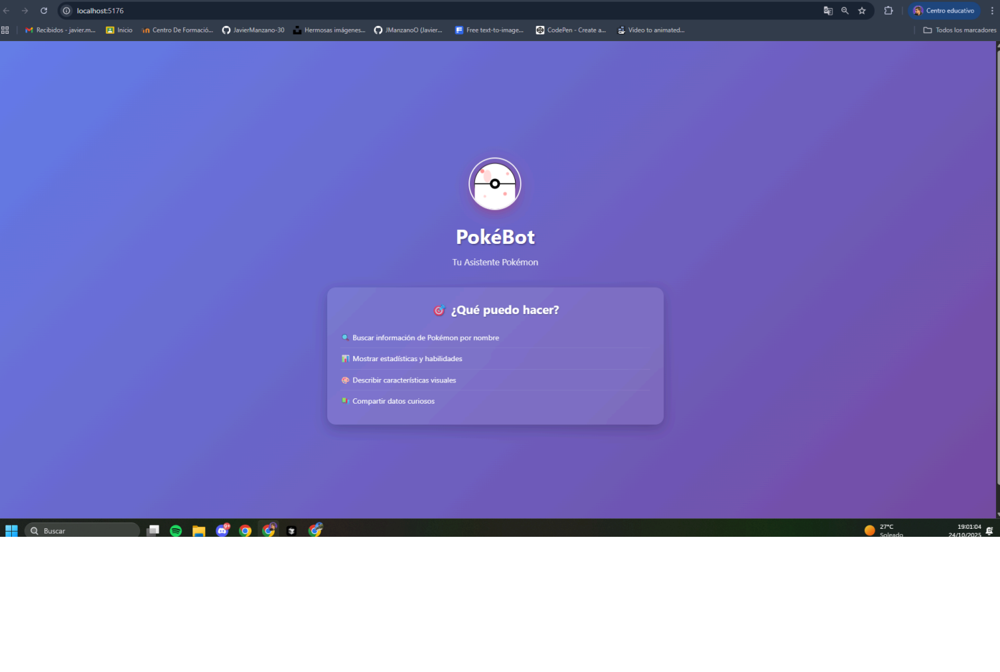
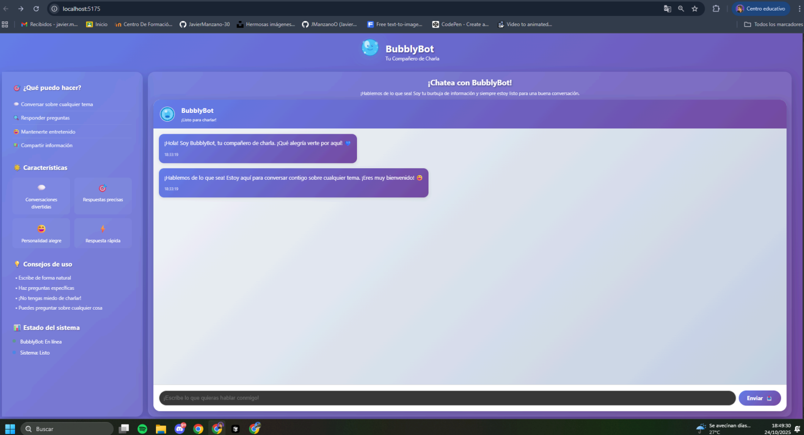
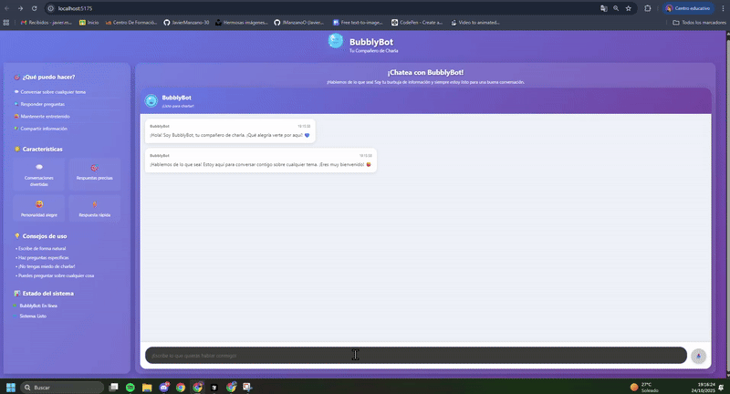
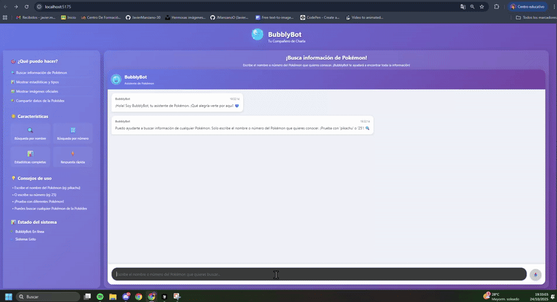
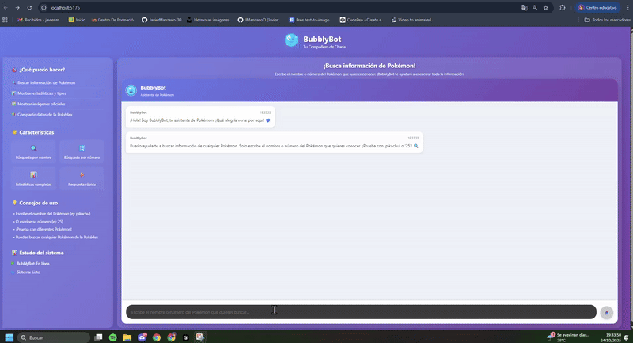
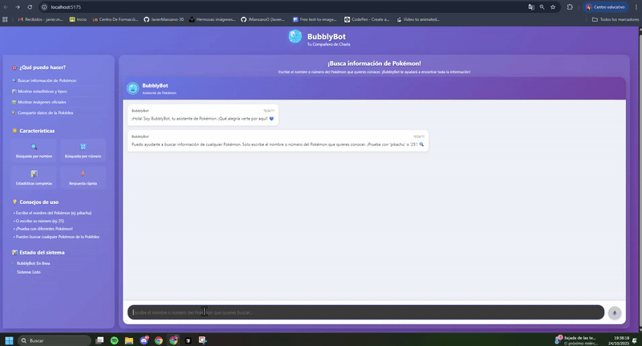

# 💻 SPRINT 4 – Chatbot de Pokémon con React

Este sprint contiene el desarrollo completo de un chatbot interactivo para búsqueda de información de Pokémon, desarrollado con React y Vite.  
El proyecto incluye integración con la API pública de Pokémon (POKEAPI) y una interfaz de usuario moderna y responsiva.

Cada actividad se encuentra documentada con archivos específicos:
- Archivos **.jsx** (componentes React)
- Archivos **.css** (estilos y diseño)
- Archivos **.js** (servicios y lógica)
- Archivos **.md** (documentación de actividades)

La estructura del repositorio es la siguiente:

```
SPRINT4/
├── src/
│   ├── components/
│   │   ├── Chatbot/
│   │   │   ├── ChatInterface.jsx    # Componente principal de la interfaz de chat
│   │   │   ├── ChatWindow.jsx       # Ventana contenedora del chat
│   │   │   ├── MessageInput.jsx     # Componente de entrada de mensajes
│   │   │   ├── MessageList.jsx      # Lista de mensajes del chat
│   │   │   └── PokemonCard.jsx      # Tarjeta de visualización de Pokémon
│   │   └── chatbot.css              # Estilos específicos del chatbot
│   ├── services/
│   │   └── pokeapi.js               # Servicio de integración con POKEAPI
│   ├── styles/
│   │   └── layout.css               # Estilos globales de layout
│   ├── assets/
│   │   ├── icons/
│   │   │   ├── bubblybot-icon.svg
│   │   │   └── pokebot-icon.svg
│   │   └── images/
│   │       ├── bubblybot-logo.svg
│   │       ├── pokebot-logo.svg
│   │       └── gifs1/
│   │           ├── ejercicio1.png
│   │           ├── ejercicio2.png
│   │           ├── ejercicio3.1.png
│   │           ├── ejercicio3.png
│   │           ├── ejercicio4.gif
│   │           ├── ejercicio5.1.gif
│   │           ├── ejercicio5.2.gif
│   │           └── ejercicio5.3.gif
│   ├── public/
│   │   ├── favicon.svg              # Favicon de la aplicación
│   │   └── vite.svg                 # Logo de Vite
│   ├── App.jsx                      # Componente raíz de la aplicación
│   ├── App.css                      # Estilos del componente App
│   ├── main.jsx                     # Punto de entrada de la aplicación
│   └── index.css                    # Estilos globales base
├── ACTIVIDAD-2-COMPLETADA.md        # Documentación de la actividad 2
├── ACTIVIDAD-3-COMPLETADA.md        # Documentación de la actividad 3
├── ACTIVIDAD-4-COMPLETADA.md        # Documentación de la actividad 4
├── ACTIVIDAD-5-COMPLETADA.md        # Documentación de la actividad 5
├── package.json                     # Configuración de dependencias y scripts
├── package-lock.json                # Lock de versiones de dependencias
├── vite.config.js                   # Configuración de Vite
├── eslint.config.js                 # Configuración de ESLint
├── index.html                       # Página HTML principal
└── README.md                        # Este archivo
```

---

## 📊 Actividad 1: Creación del Proyecto del Chatbot

**Descripción:**  
Creación del proyecto base en React con Vite, incluyendo la estructura inicial del proyecto y la personalización visual del chatbot.

**Objetivos:**
- Configuración del entorno de desarrollo React
- Estructura de carpetas organizada
- Personalización inicial del proyecto
- Verificación del funcionamiento del entorno

**Archivos principales:**  
`package.json` | `vite.config.js` | `src/main.jsx` | `src/App.jsx`

**Funcionalidades implementadas:**
- Proyecto React creado con Vite
- Estructura de carpetas preparada para escalabilidad
- Personalización visual inicial
- Servidor de desarrollo funcionando

**Pruebas realizadas (Imagen):**


---

## 🎨 Actividad 2: Personalización Visual del Chatbot

**Descripción:**  
Personalización completa de la identidad visual del chatbot, incluyendo nombre, logo, colores y elementos gráficos propios.

**Objetivos:**
- Definición de identidad visual del chatbot
- Sustitución de elementos genéricos por elementos propios
- Organización de recursos gráficos
- Integración de la identidad en la interfaz

**Archivos principales:**  
`src/App.jsx` | `src/App.css` | `src/assets/images/bubblybot-logo.svg`

**Funcionalidades implementadas:**
- Identidad visual "BubblyBot" definida
- Logo personalizado creado
- Colores y tema visual establecidos
- Recursos gráficos organizados en `src/assets/`
- Integración completa de la identidad visual

**Pruebas realizadas (Imagen):**


---

## 🏗️ Actividad 3: Estructura del Proyecto y Modularización

**Descripción:**  
Organización del proyecto en una estructura modular con carpetas separadas para componentes, estilos, servicios y recursos.

**Objetivos:**
- Estructuración del proyecto por responsabilidades
- Aislamiento de componentes del chatbot
- Preparación de la carpeta services/
- Centralización de estilos
- Integración en la aplicación raíz

**Archivos principales:**  
`src/components/Chatbot/` | `src/services/` | `src/styles/` | `src/components/chatbot.css`

**Funcionalidades implementadas:**
- Estructura modular implementada
- Componentes del chatbot aislados
- Carpeta services/ preparada para APIs
- Estilos centralizados
- Integración completa en App.jsx

**Pruebas realizadas (Imagen):**


---

## 💬 Actividad 4: Componentes Mínimos del Chatbot

**Descripción:**  
Implementación de una interfaz de chat completa similar a ChatGPT/Claude, incluyendo historial de mensajes, área de entrada y respuestas del asistente.

**Objetivos:**
- Ventana principal del chat con identidad visual
- Historial de mensajes cronológico
- Área de entrada de mensajes
- Respuestas simuladas del asistente
- Indicador de "pensando..."
- Identidad visual del asistente

**Archivos principales:**  
`src/components/Chatbot/ChatWindow.jsx` | `src/components/Chatbot/ChatInterface.jsx` | `src/components/Chatbot/MessageList.jsx` | `src/components/Chatbot/MessageInput.jsx`

**Funcionalidades implementadas:**
- Ventana de chat con header identificativo
- Historial de mensajes con diferenciación visual
- Área de entrada con botón enviar circular
- Respuestas automáticas variadas del asistente
- Indicador "Pensando..." con animación
- Scroll automático al final de la conversación
- Identidad visual BubblyBot integrada

**Pruebas realizadas (GIF):**



---

## 🔍 Actividad 5: Búsqueda de Pokémon con POKEAPI

**Descripción:**  
Integración completa con la API pública de Pokémon para búsqueda de información, incluyendo manejo de errores y visualización de datos.

**Objetivos:**
- Interpretación de consultas del usuario (nombres y números)
- Consulta a la POKEAPI
- Formato de respuesta del chatbot
- Manejo de errores y Pokémon no encontrados
- Integración natural en el flujo de chat
- Uso coherente de la estructura del proyecto

**Archivos principales:**  
`src/services/pokeapi.js` | `src/components/Chatbot/PokemonCard.jsx` | `src/components/Chatbot/ChatInterface.jsx`

**Funcionalidades implementadas:**
- Búsqueda por nombre o número de Pokémon
- Integración con POKEAPI real
- Tarjetas visuales de información de Pokémon
- Manejo de errores amigable
- Indicador "Pensando..." durante búsquedas
- Scroll interno en el área de mensajes
- Validación de entrada del usuario

**Pruebas realizadas (GIF):**
- **Búsqueda por nombre:** Pikachu  

- **Búsqueda por número:** Gengar (#094)  

- **Manejo de errores:** Pokémon inexistente  


---

## 🚀 Instalación y Uso

### Requisitos previos:
- Node.js (versión 16 o superior)
- npm o yarn

### Instalación:
```bash
# Clonar el repositorio
git clone [URL_DEL_REPOSITORIO]

# Navegar al directorio del proyecto
cd SPRINT4

# Instalar dependencias
npm install

# Ejecutar el servidor de desarrollo
npm run dev
```

### Acceso:
- Abrir el navegador en `http://localhost:5173` (o el puerto que indique Vite)
- El chatbot estará disponible y funcionando

---

## 🎯 Características Principales

### **🤖 Chatbot BubblyBot:**
- Interfaz de chat moderna y responsiva
- Búsqueda de información de Pokémon
- Integración con POKEAPI
- Manejo de errores robusto
- Diseño visual atractivo

### **🔍 Funcionalidades de Búsqueda:**
- Búsqueda por nombre de Pokémon
- Búsqueda por número de Pokédex
- Información completa de cada Pokémon
- Estadísticas base y tipos
- Imágenes oficiales de Pokémon

### **🎨 Diseño y UX:**
- Interfaz responsiva para móviles y desktop
- Scroll interno en el área de mensajes
- Animaciones suaves y transiciones
- Colores y tema visual coherentes
- Experiencia de usuario intuitiva

### **⚙️ Arquitectura Técnica:**
- React con Vite para desarrollo rápido
- Componentes modulares y reutilizables
- Servicios separados para lógica de negocio
- Estilos centralizados y organizados
- Estructura escalable y mantenible

---

## 🗂 Formato de entrega

- El proyecto completo se encuentra en la carpeta raíz `SPRINT4`.  
- Los GIFs están incrustados en este `README.md` y se encuentran en `src/assets/images/gifs1/`.  
- La estructura del repositorio respeta el formato modular de React con `src/` como carpeta principal.  
- Todos los componentes están organizados en `src/components/`.  
- Los servicios externos (APIs) están en `src/services/`.  
- Los estilos globales están centralizados en `src/styles/`.  
- Los assets (imágenes, iconos) están organizados en `src/assets/`.  
- Los archivos públicos (favicon, etc.) están en `src/public/`.  
- Todas las actividades están documentadas en archivos `.md` separados.  
- El proyecto incluye integración completa con POKEAPI.  
- La aplicación es completamente funcional y responsive.

---

## 📋 Tecnologías Utilizadas

- **Frontend:** React 18 + Vite
- **Estilos:** CSS3 con Flexbox y Grid
- **API:** POKEAPI (https://pokeapi.co/)
- **Herramientas:** Node.js, npm, ESLint
- **Desarrollo:** Servidor de desarrollo Vite

---

✍️ **Autor:** *[Javier Manzano Oliveros]*  
📆 **Fecha:** *Octubre 2025*  
🏫 **Módulo:** *Entorno Cliente – 2º DAW*  
🎯 **Proyecto:** *Chatbot de Pokémon con React*