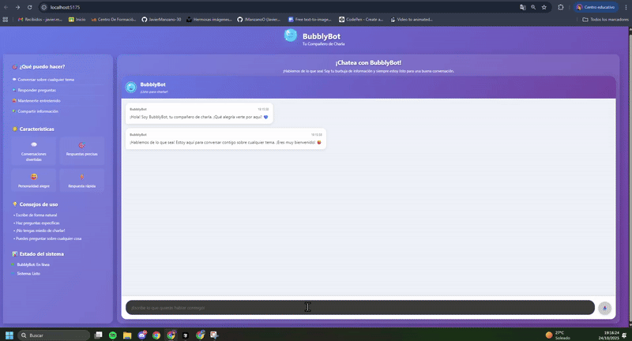

# 💻 SPRINT 4 – Chatbot BubblyBot con React

Este sprint recoge la evolución completa del chatbot **BubblyBot**, construido con React y Vite, desde la creación del proyecto hasta la integración con la POKEAPI. Cada actividad documenta objetivos, archivos relevantes, funcionalidades y evidencia visual del resultado.

---

## 📊 Actividad 1: Creación del Proyecto del Chatbot

**Descripción:**  
Creación del proyecto base en React con Vite, incluyendo la estructura inicial del proyecto y la personalización visual del chatbot.

**Objetivos:**
- Configuración del entorno de desarrollo React
- Estructura de carpetas organizada
- Personalización inicial del proyecto
- Verificación del funcionamiento del entorno

**Archivos principales:** `package.json`, `vite.config.js`, `src/main.jsx`, `src/App.jsx`

**Funcionalidades implementadas:**
- Proyecto React creado con Vite
- Estructura de carpetas preparada para escalabilidad
- Personalización visual inicial
- Servidor de desarrollo funcionando

**Pruebas realizadas (Imagen):**


---

## 🎨 Actividad 2: Personalización Visual del Chatbot

**Descripción:**  
Personalización completa de la identidad visual del chatbot, incluyendo nombre, logo, colores y elementos gráficos propios.

**Objetivos:**
- Definición de identidad visual del chatbot
- Sustitución de elementos genéricos por elementos propios
- Organización de recursos gráficos
- Integración de la identidad en la interfaz

**Archivos principales:** `src/App.jsx`, `src/App.css`, `src/assets/images/bubblybot-logo.svg`

**Funcionalidades implementadas:**
- Identidad visual "BubblyBot" definida
- Logo personalizado creado
- Colores y tema visual establecidos
- Recursos gráficos organizados en `src/assets/`
- Integración completa de la identidad visual

**Pruebas realizadas (Imagen):**


---

## 🏗️ Actividad 3: Estructura del Proyecto y Modularización

**Descripción:**  
Organización del proyecto en una estructura modular con carpetas separadas para componentes, estilos, servicios y recursos.

**Objetivos:**
- Estructuración del proyecto por responsabilidades
- Aislamiento de componentes del chatbot
- Preparación de la carpeta `services/`
- Centralización de estilos
- Integración en la aplicación raíz

**Archivos principales:** `src/components/Chatbot/`, `src/services/`, `src/styles/`, `src/components/chatbot.css`

**Funcionalidades implementadas:**
- Estructura modular implementada
- Componentes del chatbot aislados
- Carpeta `services/` preparada para APIs
- Estilos centralizados
- Integración completa en `App.jsx`

**Pruebas realizadas (Imagen):**


---

## 💬 Actividad 4: Componentes Mínimos del Chatbot

**Descripción:**  
Implementación de una interfaz de chat completa similar a ChatGPT/Claude, incluyendo historial de mensajes, área de entrada y respuestas del asistente.

**Objetivos:**
- Ventana principal del chat con identidad visual
- Historial de mensajes cronológico
- Área de entrada de mensajes
- Respuestas simuladas del asistente
- Indicador de "pensando..."
- Identidad visual del asistente

**Archivos principales:** `src/components/Chatbot/ChatWindow.jsx`, `src/components/Chatbot/ChatInterface.jsx`, `src/components/Chatbot/MessageList.jsx`, `src/components/Chatbot/MessageInput.jsx`

**Funcionalidades implementadas:**
- Ventana de chat con header identificativo
- Historial de mensajes con diferenciación visual
- Área de entrada con botón enviar circular
- Respuestas automáticas variadas del asistente
- Indicador "Pensando..." con animación
- Scroll automático al final de la conversación
- Identidad visual BubblyBot integrada

**Pruebas realizadas (GIF):**



---

## 🔍 Actividad 5: Búsqueda de Pokémon con POKEAPI

**Descripción:**  
Integración completa con la API pública de Pokémon para búsqueda de información, incluyendo manejo de errores y visualización de datos.

**Objetivos:**
- Interpretación de consultas del usuario (nombres y números)
- Consulta a la POKEAPI
- Formato de respuesta del chatbot
- Manejo de errores y Pokémon no encontrados
- Integración natural en el flujo de chat
- Uso coherente de la estructura del proyecto

**Archivos principales:** `src/services/pokeapi.js`, `src/components/Chatbot/PokemonCard.jsx`, `src/components/Chatbot/ChatInterface.jsx`

**Funcionalidades implementadas:**
- Búsqueda por nombre o número de Pokémon
- Integración con POKEAPI real
- Tarjetas visuales de información de Pokémon
- Manejo de errores amigable
- Indicador "Pensando..." durante búsquedas
- Scroll interno en el área de mensajes
- Validación de entrada del usuario

**Pruebas realizadas (GIF):**

  
  


---

## 🗂️ Estructura del Proyecto

```
SPRINT4/
├── src/
│   ├── components/
│   │   ├── Chatbot/
│   │   │   ├── ChatInterface.jsx
│   │   │   ├── ChatWindow.jsx
│   │   │   ├── MessageInput.jsx
│   │   │   └── MessageList.jsx
│   │   └── chatbot.css
│   ├── services/
│   │   └── lmstudio.js
│   ├── styles/
│   │   └── layout.css
│   ├── assets/
│   │   ├── icons/
│   │   │   └── bubblybot-icon.svg
│   │   └── images/
│   │       ├── bubblybot-logo.svg
│   │       └── gifs/
│   │           ├── ejercicio1.png
│   │           ├── ejercicio2.png
│   │           ├── ejercicio3.png
│   │           ├── ejercicio3.1.png
│   │           ├── ejercicio4.gif
│   │           ├── ejercicio5.1.gif
│   │           ├── ejercicio5.2.gif
│   │           └── ejercicio5.3.gif
│   ├── public/
│   │   ├── favicon.svg
│   │   └── vite.svg
│   ├── App.jsx
│   ├── App.css
│   ├── main.jsx
│   └── index.css
├── package.json
├── package-lock.json
├── vite.config.js
├── eslint.config.js
├── index.html
├── README.md
└── INSTRUCCIONES_USO.md
```

---

## 🚀 Instalación y Uso

**Requisitos previos:** Node.js (≥16), npm o yarn, LM Studio configurado.

```bash
# Navegar al directorio del proyecto
cd SPRINT4

# Instalar dependencias
npm install

# Ejecutar el servidor de desarrollo
npm run dev
```

**Acceso:** `http://localhost:5173` (o el puerto que indique Vite)  
**Nota:** Ejecuta LM Studio en el puerto 1234 antes de usar el chatbot.

---

## 📋 Tecnologías Utilizadas

- **Frontend:** React 19 + Vite
- **Estilos:** CSS3 con Flexbox y Grid
- **API:** LM Studio (OpenAI-compatible) y POKEAPI
- **Herramientas:** Node.js, npm, ESLint
- **Desarrollo:** Servidor de desarrollo Vite

---

✍️ **Autor:** *Javier Manzano Oliveros*  
📆 **Fecha:** *2025*  
🏫 **Módulo:** *Entorno Cliente – 2º DAW*  
🎯 **Proyecto:** *Chatbot BubblyBot con React*
