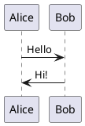

# PlantUML Server con Docker

Este proyecto configura un servidor PlantUML usando Docker que se ejecuta en `localhost:8088`.

## Requisitos

- Docker instalado
- Docker Compose (incluido con Docker Desktop)

## Uso

### Iniciar el servidor

```bash
docker-compose up -d
```

### Acceder al servidor

Abre tu navegador y navega a: **http://localhost:8088**

### Detener el servidor

```bash
docker-compose down
```

### Ver los logs

```bash
docker-compose logs -f
```

## Comandos Docker alternativos (sin docker-compose)

Si prefieres usar comandos Docker directamente:

### Iniciar
```bash
docker run -d -p 8088:8080 --name plantuml-server plantuml/plantuml-server:jetty
```

### Detener
```bash
docker stop plantuml-server
docker rm plantuml-server
```

## Ejemplo de uso

Una vez que el servidor esté corriendo, puedes:

1. Acceder a la interfaz web en http://localhost:8088
2. Escribir código PlantUML directamente en el editor
3. Generar diagramas en tiempo real

### Ejemplo de código PlantUML



